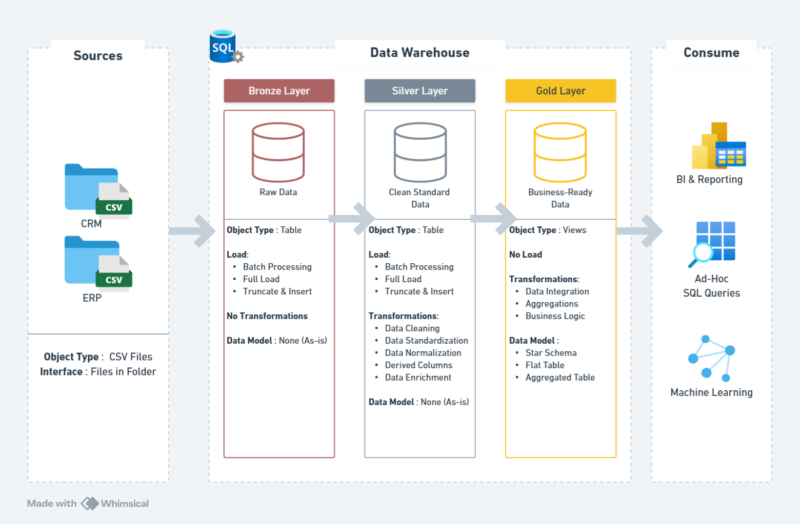

# Data Warehouse & Analytics Project

Welcome to the **Data Warehouse & Analytics Project** repository! 🚀  

This project showcases a complete end-to-end data warehousing and analytics solution. It covers the entire workflow—from designing and building a robust data warehouse to performing advanced analytics and generating actionable business insights. 
Developed as a portfolio project, it demonstrates best practices in **data engineering**, **data modeling**, and **analytics**, reflecting real-world industry standards.

---
## 🏗️ Data Architecture

The data architecture for this project follows the **Medallion Architecture** with three layers: **Bronze**, **Silver**, and **Gold**.  



1. **Bronze Layer**:  
   Stores raw, unprocessed data directly from source systems. In this project, data is ingested from CSV files into a **SQL Server** database.

2. **Silver Layer**:  
   Performs data cleansing, standardization, and normalization to prepare the data for analysis.

3. **Gold Layer**:  
   Contains business-ready data structured in a **star schema**, optimized for reporting and advanced analytics.

---
## 📋 Project Workflow
A detailed project workflow and step-by-step guide are available in [workflow.pdf](docs/workflow.pdf).
---
## 📖 Project Overview

This project demonstrates a complete data warehousing and analytics workflow, including:

1. **Data Architecture**: Designing a modern data warehouse using the **Medallion Architecture** with **Bronze**, **Silver**, and **Gold** layers.
2. **ETL Pipelines**: Extracting, transforming, and loading data from source systems into the data warehouse.
3. **Data Modeling**: Creating fact and dimension tables optimized for analytical queries.
4. **Analytics & Reporting**: Developing SQL-based reports and dashboards to generate actionable business insights.

🎯 This repository serves as a valuable resource for professionals and students aiming to showcase expertise in:

- SQL Development  
- Data Architecture  
- Data Engineering  
- ETL Pipeline Development  
- Data Modeling  
- Data Analytics  

---
## 🛠️ Important Links & Tools:

Everything is for Free!
- **[Datasets](datasets/):** Access to the project dataset (csv files).
- **[SQL Server Express](https://www.microsoft.com/en-us/sql-server/sql-server-downloads):** Lightweight server for hosting your SQL database.
- **[SQL Server Management Studio (SSMS)](https://learn.microsoft.com/en-us/sql/ssms/download-sql-server-management-studio-ssms?view=sql-server-ver16):** GUI for managing and interacting with databases.
- **[Git Repository](https://github.com/):** Set up a GitHub account and repository to manage, version, and collaborate on your code efficiently.
- **[Whimsical](https://whimsical.com/):** Design data architecture, models, flows, and diagrams.
- **[Notion](https://www.notion.com/):** All-in-one tool for project management and organization.
- **[Notion Project Steps](https://www.notion.so/Data-Warehouse-Project-c0c4d030c269481d916073859f1f76b0?source=copy_link):** Access to All Project Phases and Tasks.
---

## 🚀 Project Requirements

### Building the Data Warehouse (Data Engineering)

#### Objective
Develop a modern data warehouse using **SQL Server** to consolidate sales data, enabling analytical reporting and data-driven decision-making.

#### Specifications
- **Data Sources**: Import data from two source systems (ERP and CRM) provided as CSV files.  
- **Data Quality**: Perform data cleansing to address inconsistencies and ensure reliability for analysis.  
- **Integration**: Merge both sources into a unified, user-friendly data model optimized for analytical queries.  
- **Scope**: Focus on the latest dataset; historical data tracking is not required.  
- **Documentation**: Deliver clear documentation of the data model to support both business stakeholders and analytics teams.

---

### BI: Analytics & Reporting (Data Analysis)

#### Objective
Develop SQL-based analytics to provide actionable insights into:

- **Customer Behavior**  
- **Product Performance**  
- **Sales Trends**  

These insights enable stakeholders to track key business metrics and make informed, strategic decisions.

## 📂 Repository Structure
```
data-warehouse-project/
│
├── datasets/                           # Raw datasets used (ERP and CRM data)
│
├── docs/                               # Project documentation and architecture details
│   ├── data_architecture.png           # Whimsical file shows the project's architecture
│   ├── data_catalog.md                 # Catalog of datasets, including field descriptions and metadata
│   ├── data_flow.png                   # Whimsical file for the data flow diagram
│   ├── data_models.dpng                # Whimsical file for data models (star schema)
│   ├── naming-conventions.md           # Consistent naming guidelines for tables, columns, and files
|   ├── workflow.pdf                    # Notion template workflow to map progress of project
│
├── scripts/                            # SQL scripts for ETL and transformations
│   ├── bronze/                         # Scripts for extracting and loading raw data
│   ├── silver/                         # Scripts for cleaning and transforming data
│   ├── gold/                           # Scripts for creating analytical models
│
├── tests/                              # Test scripts and quality files
│
├── README.md                           # Project overview and instructions
├── LICENSE                             # License information for the repository

```
---


## 🛡️ License

This project is licensed under the [MIT License](LICENSE). You are free to use, modify, and share this project with proper attribution.

## 👤 About Me

Hi, I’m **Divyang Palshetkar**. I have hands-on experience in designing and implementing modern data warehousing solutions, with expertise in **ETL development**, **data modeling**, **SQL analytics**, and creating **actionable business insights** from complex datasets.  

I enjoy transforming raw data into meaningful, decision-driving insights and continuously exploring new technologies and best practices in **data engineering** and **business intelligence**.  

This project reflects my commitment to building scalable, efficient, and well-documented data solutions following industry standards.
---
